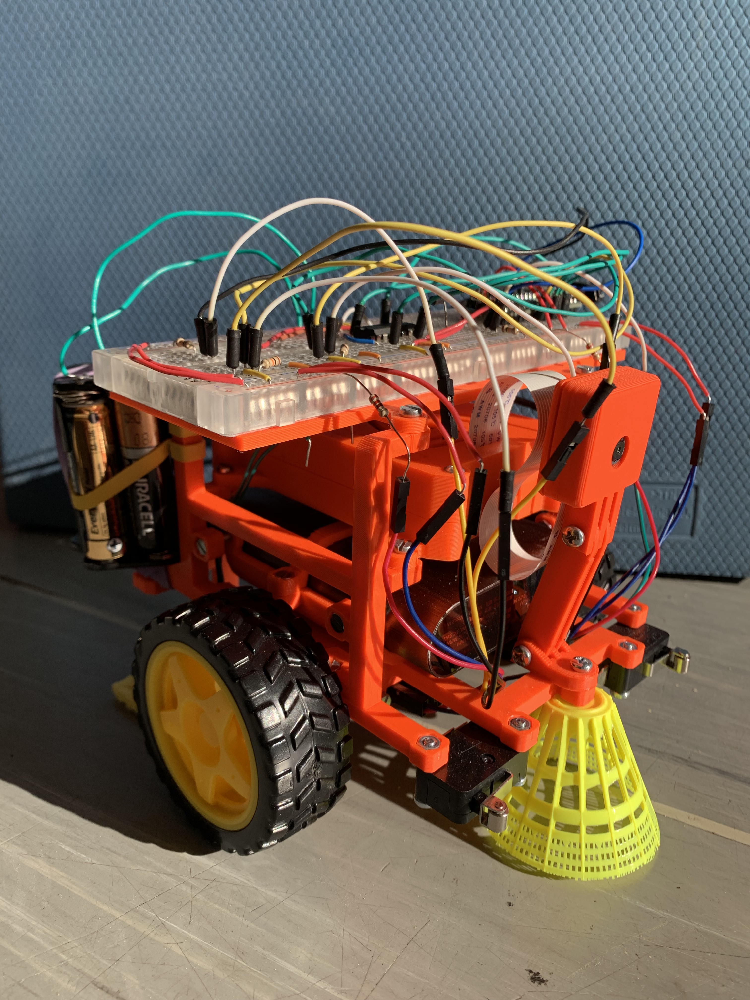

# Robot DustBot

This repo contains website and code used to make robot DustBot - cheap, programmable robot used for AI research and learning about robotics.
It is made from inexpensive components such as Raspberry Pi, Arduino and 3D printed chasis.
For more info, view [website](https://martinerk0.github.io/dustbot/), or see [video](https://www.youtube.com/watch?v=c6rpKZGmOfw) on youtube.

