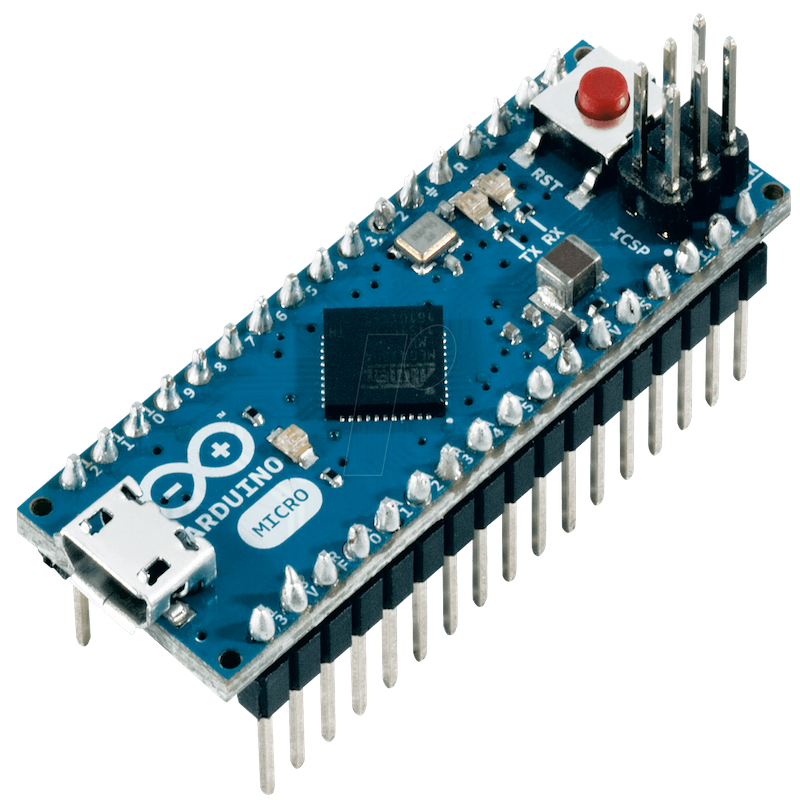

### Introduction

The idea for this project came from living in a dusty environment at dormitory 17. Listopadu. 
Because of its unfortunate proximity to busy road Mestsky okruh, and old air conditioning from the communist era, rooms are filled with dusty particles exceptionally fast - fast enough to warrant building an autonomous robot for cleaning them.

 
 
 
### Goals

We loosely summarized our requirements in these goals: 

- Create robot that cleans dust in a room,
- should be autonomous,
- should be cheap to build,
- should be adaptable,
- and could be designed iteratively.

### Design of robot
Since this is my first experience with robotics, I strived for easy design that could be easily modified and adapted. We designed chassis of Dustbot in an easy beginner friendly online app www.tinkercad.com.

- iterated developments how requirements ands ideas changed - iterated development of robot design 
- Requirement
- Reuse of 3rd party models aka case for raspberry or camera

[Thingiverse](https://www.thingiverse.com)

### modelling tool 
- There are lot of expressive software to model physical things, but we chose thingiverse.com since we did not have any previous experience with 3D modelling
- project requirements:
    - learn about robotics
    - Learn about electronics
    - Build something that is working
    - not expensive, should use easily available components
    - sotfware oriented- hardware should be as simple as possible

### Parts of Robot
- chassis: 3D printed
- actuators: motors with wheels
- sensors: 
    - range: camera
         ultrasound
         lidar
    - bodily: odometry
    - tactile: switches

 ### sensors
  - Tactile
  -	Odometry
  -	Camera 
  -	Ultrasound?
  
 

### Actuators
- motors

# Software:
- _Raspberry Pi_
- Ubuntu
- RO
- PySerial
- Arduino
- For getting input and control motors

- add some images

