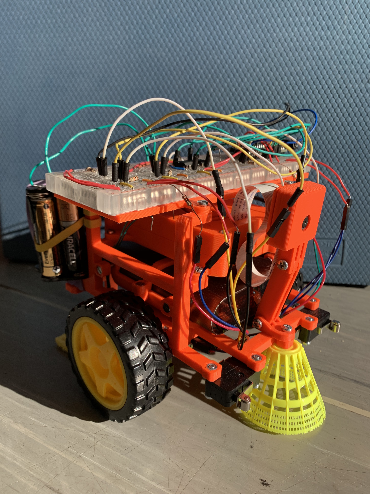

# Introduction

The idea for this project came from living in a dusty environment at college dormitory in Prague.
Because of its unfortunate proximity to busy highway, rooms are filled with dusty particles exceptionally fast - fast enough to warrant building an autonomous robot for cleaning them.
 
 
 
# Goals

To sum up our project goals, we want to:
- create robot that cleans dust in a room,
- should be autonomous,
- use available, not expensive components,
- should be modular (adding or removing part of the robot does not mean rebuilding all of it),
- could be easily replicated.

# Parts of Robot
- 3D printed parts
   - Chassis
   - Raspberry case
   - Camera case
- actuators: motors with wheels
- sensors: 
    - range:   
        - camera
        - ultrasound [Not used]
        - lidar [Not used]
    - bodily: odometry
    - tactile: switches
 - Logic chips
   - [Raspberry Pi 3B](https://www.raspberrypi.org/products/raspberry-pi-3-model-b/)
   - [Arduino Micro](https://store.arduino.cc/arduino-micro)
   - [L239D chip](http://www.ti.com/lit/ds/symlink/l293.pdf)
 - wires & resistors
 - battery pack
 - rechargable batteries for powering motors

    
## Chassis

We strived for easy design that could be easily modified and adapted. We designed chassis of Dustbot in an easy-to-learn online app [Tinkercad](www.tinkercad.com).

Here can see bottom part of the Dustbot. It provides support for the whole robot. Notice that motel is rotated by 180 degrees, that is because this is the way it is 3D printed, but actually it is used upside down.

Because we added components on the fly, we used **iterated design**. As you can see on this picture, you can see progress of design of bottom part of Dustbot. With 3D printer you can see which parts really holds up in real world or not, and improve them if necessary.

I also wanted to utilize already created parts, which is raspberry holder and camera holder, and incorporate them into the robot easily.

[Thingiverse](https://www.thingiverse.com)

Since creating whole chassis **at once** would be hard to design, hard to 3D print, we split chassis into **several parts**.
These are:
- bottom part
- side parts
- breadboard holder + breadboard
- rear part with kitchen cloth for collecting dust
- battery holder
- raspberry pi case (downloaded from thingiverse)
- camera holder (downloaded from thingiverse)

### Bottom part
This is the base component, it is holding motors, and all other parts are connected to it.
Motors are attached by four M3x20? screws. Side parts are attached by four M3x10 bolts

[Dustbot bottom part](models/dustbot_bottom.stl).

### Side parts
They are attached to base components, forming sides of robot. Onto them are attached other parts:
- battery holder
- raspberry pi case
- breadboard holder

Left and right are symmetrical.

[Side part](models/dustbot_side.stl).

### Breadboard holder
Breadboard is attached to the breadboard holder by sticky tape. Breadboard holder itself is attached to side parts by four M3x8 nuts.

[Side part](models/BreadBoard_holder.stl).

### Rear part
This part is subject to change. It prevents robot from falling backward when accelerating forward, and collects dust by kitchen cloth attached by two M3x10 bolts. 

[Rear part](models/dustbot_rear.stl).

### Battery holder
This part is attached by M3 nuts to the side parts, and can be removed by pulling it from back.
We designed it this way, so you can create your own holder for battery pack and attach it to side parts.

[Battery 1st part](models/dustbot_battery.stl)
[Battery 2nd part](models/dustbot_battery2.stl)

### Raspberry Pi 3 case & camera case
These models are available on thingiverse.

## Actuators
We chose [differential steering](https://en.wikipedia.org/wiki/Differential_steering) because it is easy to program, and uses only two motors.

We used TT motors, they are available on Ebay or Aliexpress for 2 dollars each.
Motors are attached to bottom part by four M3x24 bolts with nuts.

## Sensors
Robot needs information of what is going around him. The most basic is touch, but he also should be able to sense distant objects like _furniture_ so it can avoid them or in case of _dirt_ and _dust_, go to them and clean them.
 
### Tactile
For detecting touch, we used Zippy VMN 06 micro switch.
Switch is attached to bottom part by two M3x10 bolts.

 
### Odometry
For future implementation of localization, we need to know where we are. Odometry is tool how to help us. We could use motor with built-in encoder, but that is not cheap, so we adapted rotary encoder model from thingiverse for TT motors.
 
 
 
 
[Side part](models/wheel_encoder.stl).
 
 
### Camera 
Camera is data rich, cheap sensor, that could be used in future improvements for object detection and collision evasion.
We used [raspberry pi 2 camera] (https://www.raspberrypi.org/products/camera-module-v2/) which costs around 30$.
For more info, read [documentation](https://www.raspberrypi.org/documentation/usage/camera/)

It would be better to use fish lens camera, because it offers vastly bigger field of view.

 
 
### Ultrasound
We bought several ultrasound sensors that will be added in future versions.

## Chassis setup
Here we describe how to build robot from all parts, and how to setup electronics.

1. print all 3D printed parts 
2. clean nut bevels so nuts go in easily
3. attach motors to bottom part
4. attach wheels to motors
5. attach rear part to the robot
6. put raspberry into case and screw it into side parts using M3 bolts
7. glue breadborad onto breadboard holder and screw it on top of side parts
8. attach rotary encoder onto TT motor 
9. attach optocouplets onto the bottom part
10. attach switches onto bottom part using four M3x12 nuts

## Wiring

Put arduino micro and other parts onto breadboard according to this diagram.
Put usb cable from Raspberry Pi to Arduino and from battery pack to Raspberry Pi.

## Software:
- [Ubuntu](https://ubuntu-mate.org): we used Ubuntu Mate 18.04.3 LTS. 
- [ROS](http://wiki.ros.org/melodic/Installation) - we installed ROS Melodic Morenia
- [PySerial](https://pythonhosted.org/pyserial/) - we use this library to communicate with Arduino.
- [Arduino](https://www.arduino.cc) - we need somehow to get inputs from switches, odometry and to control motors. Since we don't want to burn our Raspberry Pi by experimenting, it is reasonable to use arduino for this. You can also debug I/O of arduno with your notebook instead of Raspberry Pi.
