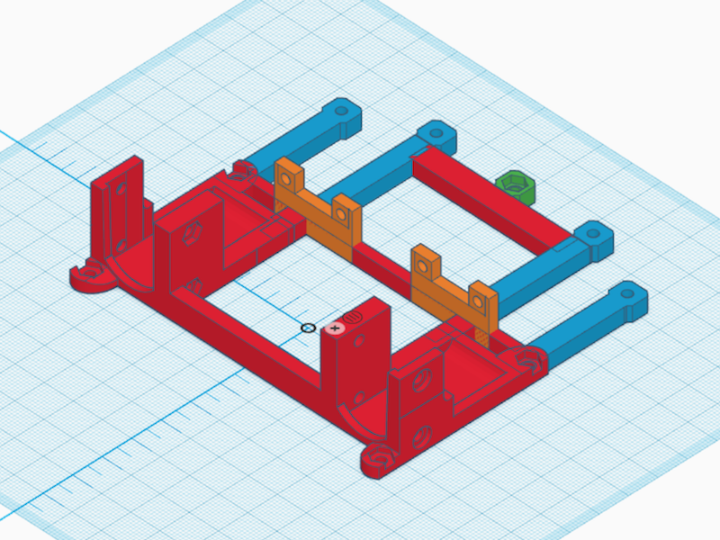
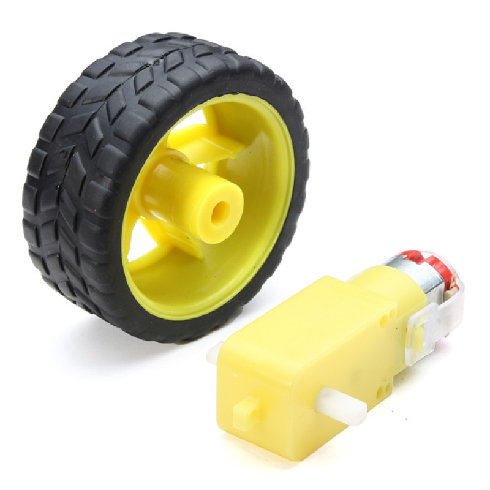
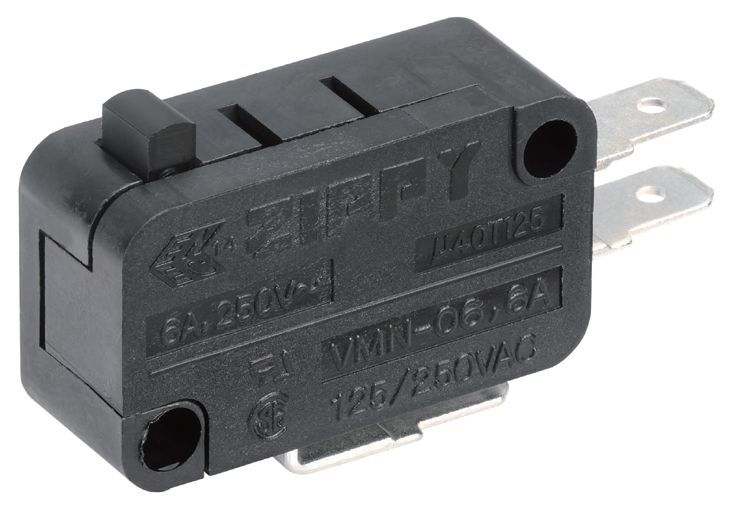
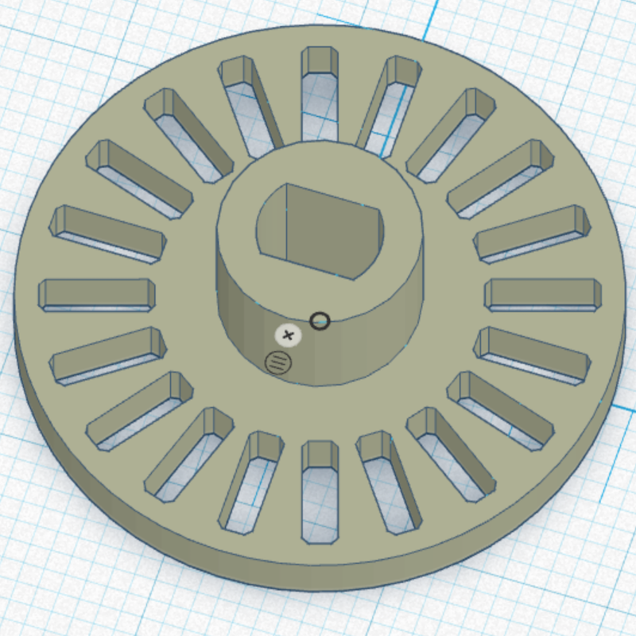
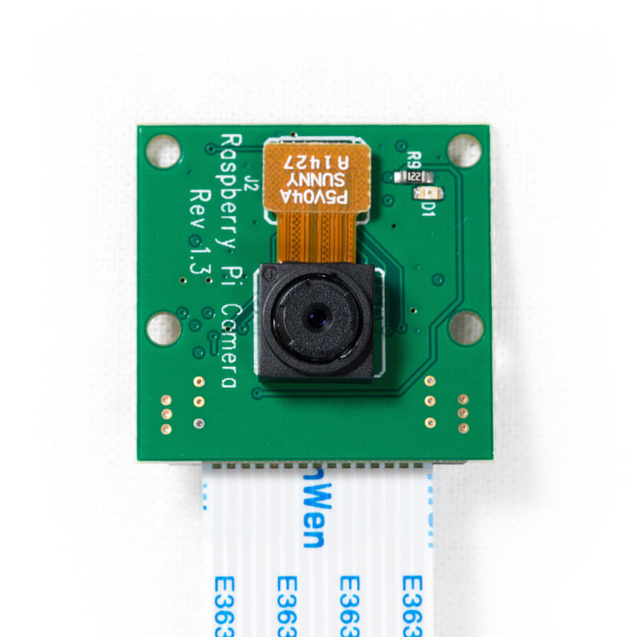

# Introduction

The idea for this project came from living in a dusty environment at college dormitory in Prague.
Because of its unfortunate proximity to busy highway rooms are filled with dusty particles exceptionally fast - fast enough to warrant building an autonomous robot for cleaning them.
 
 
 
# Goals

To sum up our project goals, we want to:
- create robot that cleans dust in a room,
- should be autonomous,
- use available, not expensive components,
- should be modular (adding or removing part of the robot does not mean rebuilding all of it),
- could be easily replicated.

# Parts of Robot
- 3D printed parts
   - Chassis
   - Raspberry case
   - Camera case
- actuators: motors with wheels
- sensors: 
    - range:   
        - camera
        - ultrasound
        - lidar
    - bodily: odometry
    - tactile: switches
    
## Chassis

We strived for easy design that could be easily modified and adapted. We designed chassis of Dustbot in an easy-to-learn online app [Tinkercad](www.tinkercad.com).

Here can see bottom part of the Dustbot. It provides support for the whole robot. Notice that motel is rotated by 180 degrees, that is because this is the way it is 3D printed, but actually it is used upside down.

Because we added components on the fly, we used **iterated design**. As you can see on this picture, you can see progress of design of bottom part of Dustbot. With 3D printer you can see which parts really holds up in real world or not, and improve them if necessary.

I also wanted to utilize already created parts, which is raspberry holder and camera holder, and incorporate them into the robot easily.

[Thingiverse](https://www.thingiverse.com)

Since creating whole chassis **at once** would be hard to design, hard to 3D print, we split chassis into **several parts**.
These are:
- bottom part
- side parts
- breadboard holder + breadboard
- rear part with kitchen cloth for collecting dust
- battery holder
- raspberry pi case (downloaded from thingiverse)
- camera holder (downloaded from thingiverse)

### Bottom part
This is the base component, it is holding motors, and all other parts are connected to it.
Motors are attached by four M3x20? screws. Side parts are attached by four M3x10 bolts

### Side parts
They are attached to base components, forming sides of robot. Onto them are attached other parts, such as:
They serve as scaffolding onto which are other parts attached. Left and right are symmetrical.

### Breadboard holder

This is modelled so it fits same Vega dimensions as raspberry case.
Breadboard is attached to it by sticky tape.

### Rear part

This part is subject to change. It prevents robot from falling backward when accelerating forward, and collects dust by kitchen cloth attached by M3 bolts. 

## Actuators
I chose [differential steering](https://en.wikipedia.org/wiki/Differential_steering) because it is easy to program, and uses only two motors.

We used TT motors, they are available on Ebay or Aliexpress for 2 dollars each.

## Sensors
Robot needs information of what is going around him. The most basic is touch, but he also should be able to sense distant objects like _furniture_ so it can avoid them or in case of _dirt_ and _dust_, go to them and clean them.
 
### Tactile
For detecting touch, we used Zippy VMN 06 micro switch.

 
### Odometry
 use motor with encoder, but that is not cheap, so we adapted model from thingiverse for TT motor
 
 
 
 
### Camera 
Camera is very rich and cheap sensor, that could be used in future improvements for object detection and collision evasion.
We used [raspberry pi 2 camera] (https://www.raspberrypi.org/products/camera-module-v2/) which costs around 30$.
For more info, read [documentation](https://www.raspberrypi.org/documentation/usage/camera/)

It would be better to use fish lens camera, because it offers vastly bigger field of view.

 
 
### Ultrasound
We bought several ultrasound sensors that will be added in future versions.

## Software:
- _Raspberry Pi_
- Ubuntu
- RO
- PySerial
- Arduino
- For getting input and control motors

- add some images
